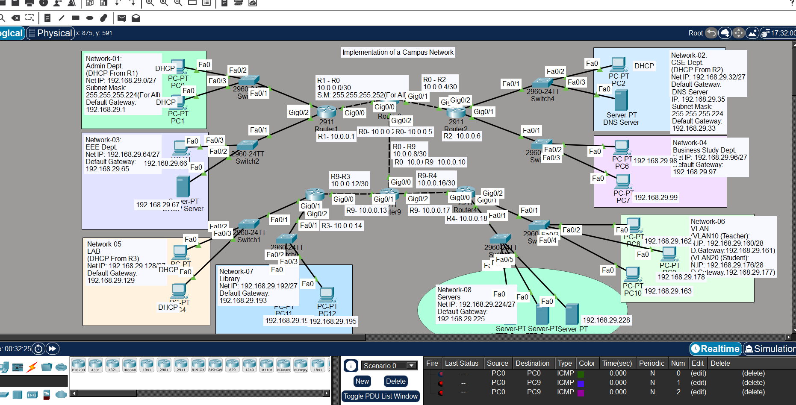

# Implementation of a Campus Network

## 📌 Project Overview

This project demonstrates the design and implementation of a Campus Network using Cisco Packet Tracer.

The network connects multiple departments, VLANs, and network services. The campus network is divided into multiple subnets and includes dynamic routing, DHCP, DNS, HTTP, FTP, and SMTP services.

Multiple routers are interconnected using point-to-point links, and OSPF is used for dynamic routing between different networks.

---

## Network Topology


The network consists of:

- Multiple Cisco Routers
- Cisco Switches
- Multiple Departmental Networks
- VLAN Segmentation
- Dedicated Server Network
- DHCP Services
- DNS Services
- HTTP Services
- FTP Services
- SMTP/Email Services
- OSPF Dynamic Routing

---

## 🌐 Departmental Networks

The campus network is divided into multiple networks for different departments and services:

| Network | Department / Service |
|---|---|
| Network-01 | Admin Department |
| Network-02 | CSE Department |
| Network-03 | EEE Department |
| Network-04 | Business Studies Department |
| Network-05 | Lab |
| Network-06 | VLAN Networks |
| Network-07 | Library |
| Network-08 | Server Farm |

Each department is assigned to a separate subnet to improve network organization and management.

---

## 🔀 VLAN Configuration

The project includes VLAN-based network segmentation.

### VLAN 10
Used to separate one group of users within the campus network.

### VLAN 20
Used to separate another group of users within the campus network.

VLANs provide logical network separation and help organize communication between different groups.

---

## 📡 Routing Configuration

Multiple routers are interconnected using point-to-point links.

### Routing Protocol

*OSPF (Open Shortest Path First)* is used for dynamic routing between routers.

OSPF allows routers to automatically exchange routing information and find routes to different networks.

---

## ⚙️ Technologies Used

- Cisco Packet Tracer
- IPv4 Addressing
- Subnetting
- VLAN
- OSPF
- DHCP
- DNS
- HTTP
- FTP
- SMTP

---

## 🛠️ Network Services

### DHCP
DHCP is used to automatically assign IP addresses to client devices in selected networks.

### DNS
A DNS server is configured to provide name resolution services.

### HTTP
A web server is configured to provide web services.

### FTP
An FTP server is configured for file transfer services.

### SMTP
An email server is configured to provide email services.

---

## 🏗️ Network Design

The campus network connects multiple departments through routers and switches.

The design includes:

- Department-based network segmentation
- Separate subnets for different networks
- VLAN-based logical segmentation
- Dynamic routing using OSPF
- Centralized network services
- A dedicated server farm
- Point-to-point router connections

---

## 🧪 Testing

The network can be tested using:

- ping
- Simple PDU in Cisco Packet Tracer
- Communication between different departmental networks
- DHCP IP address assignment
- DNS name resolution
- Web server connectivity
- FTP service connectivity
- Email service connectivity

---

## 🚀 How to Run

1. Install Cisco Packet Tracer.
2. Download or clone this repository.
3. Open the following project file:

   Campus-Network.pkt

4. Wait for the network topology to load.
5. Check the router, switch, VLAN, and server configurations.
6. Use ping or Simple PDU to test connectivity between different networks.

---

## 📁 Project Structure

```text
Campus-Network/
│
├── Campus-Network.pkt
└── README.md
